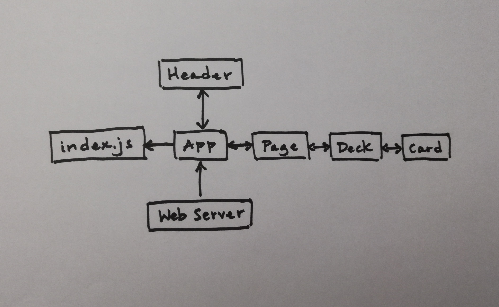

 Week 7 Project
=================================================

## Full Stack React

### Author: Katherine Smith

### Links and Resources
* [Web Server Repository](https://github.com/ksmith10309/full-stack-project-web-server)
* [React App Repository](https://github.com/ksmith10309/full-stack-project-react-application)
* [Deployed Web Server](https://full-stack-project-web-server.herokuapp.com/)
* [Deployed React App](http://full-stack-react-app-deploybucket-vgzw4a262qkw.s3-website-us-west-2.amazonaws.com/)

### React App Modules
#### `index.js`
- Imports the App component
- Renders the App component

#### `App.js`
- Imports the Header component
- Imports the Page component
- Contains the App component
  - Contains state for content and title
  - Contains componentDidMount method to make superagent request to web server
  - Renders the Header component and the Page component
- Exports the App component

#### `header.js`
- Contains the Header component
  - Renders the header
- Exports the Header component

#### `page.js`
- Imports the Deck component
- Contains the Page component
  - Iterates and renders the Deck component
- Exports the Page component

#### `deck.js`
- Imports the Card component
- Contains the Deck component
  - Renders the deck header
  - Iterates and renders the Card component
- Exports the Deck component

#### `card.js`
- Contains the Card component
  - Renders the title, copy, image, and links of the card
- Exports the Card component

### Setup
#### Running the app
* `npm start`
* Displays the React app in the browser at localhost:3000

#### Tests
* `npm test`
* The assertion that each component renders without crashing was made
* The assertion that the header component, the deck component, and the card component is alive at application start was made

#### UML
